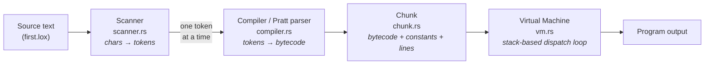
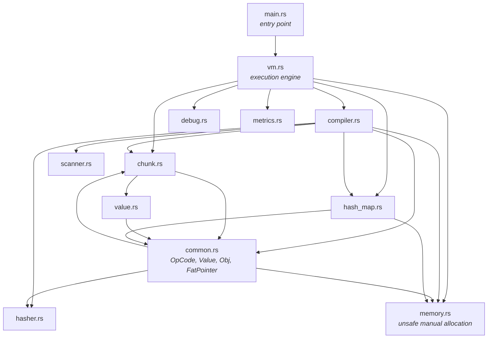
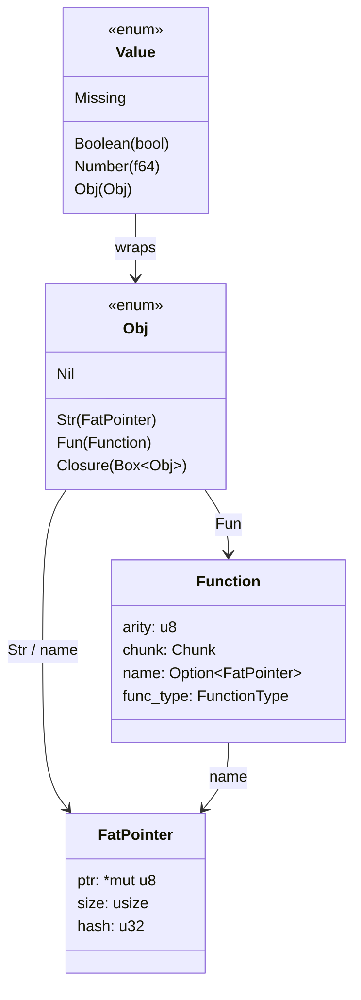
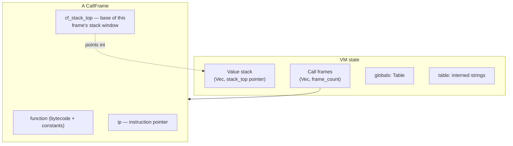
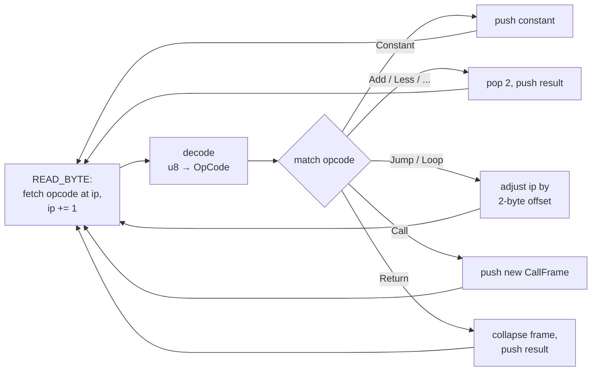
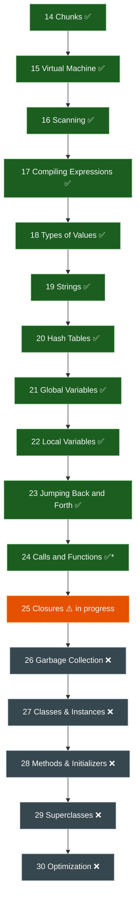

# rlox — Architecture & Status

`rlox` is a **bytecode virtual machine for the Lox language**, written in Rust. It follows
the `clox` design from Part III of Robert Nystrom's *Crafting Interpreters* — but translated
into Rust, deliberately keeping the low-level, manual-memory style of the C original so the
project doubles as a way to learn VM internals, language implementation, and Rust at once.

Unlike a tree-walking interpreter, rlox **compiles source to bytecode** and then executes that
bytecode on a stack machine. There is no AST: the compiler emits instructions as it parses.

---

## 1. The pipeline

Source text flows through four stages and ends up executing on the VM:



Key property: the scanner is **lazy / on-demand**. The compiler pulls the next token only when
it needs it (`advance`), rather than tokenizing the whole file up front. And compilation is
**single-pass** — bytecode is emitted immediately while parsing, so the compiler sometimes has
to emit an instruction *before* it knows an operand it needs (fixed later by *backpatching*).

---

## 2. Module map

How the source files depend on each other:



| File | Role |
|------|------|
| `main.rs` | Entry point. Currently hardcoded to run `first.lox` (REPL/CLI scaffolding is disabled). |
| `scanner.rs` | Lexer. Turns source characters into `Token`s (type + source offsets, not owned strings). |
| `compiler.rs` | Single-pass compiler + Pratt parser. Emits bytecode into a `Chunk`. |
| `chunk.rs` | A `Chunk`: the compiled code of one function (bytecode, constant pool, line info) + disassembler. |
| `common.rs` | Core types: `OpCode`, `Value`, `Obj`, `FatPointer`, `Function`, conversions. |
| `value.rs` | `ValueArray` — the constant pool backing a chunk. |
| `vm.rs` | The bytecode interpreter: value stack, call frames, dispatch loop. |
| `hash_map.rs` | Open-addressing hash table (`Table`) for globals and string interning. |
| `hasher.rs` | FNV-1a string hash. |
| `memory.rs` | Manual `unsafe` allocation (`*mut u8` + `Layout`) for string storage. |
| `debug.rs` | Compile-time debug/trace flags and value printing. |
| `metrics.rs` | Simple `Instant`-based timing of compile/run phases. |

---

## 3. Data model — how a Lox value is represented



- `Value` is a **tagged union** (Rust enum): every runtime value is a bool, an `f64` number, a
  heap object, or `Missing` (Lox `nil`).
- Strings are **not** Rust `String`s. They're a `FatPointer` — a raw pointer + length + cached
  hash — mirroring clox's `ObjString`. The bytes live in memory hand-allocated by `memory.rs`.
  *(Idiomatic Rust would use `Rc<str>`; the raw-pointer approach is a deliberate exercise.)*
- `Closure` boxes an `Obj` because it refers to a `Function` object (a recursive type needs
  indirection in Rust).

---

## 4. Execution model — the stack machine

The VM is a **stack-based interpreter**. Instructions push/pop operands on a value stack. Each
function call gets a `CallFrame` that owns a *window* into that shared stack.



The dispatch loop (`vm.rs::run`) is the classic fetch–decode–execute cycle:



- **Local variables are stack slots.** A local declared in a function lives at
  `cf_stack_top + index`; `GetLocal`/`SetLocal` read/write that slot directly. Slot 0 of each
  frame is reserved for the function/closure object itself.
- **Globals** live in a hash table keyed by interned name.
- **Control flow** uses two-byte (big-endian) jump offsets patched in by the compiler.

---

## 5. Where we are — Crafting Interpreters progress

rlox tracks the `clox` half of the book (chapters 14–30). Current status:



**Legend:** ✅ done · ⚠️ in progress · ❌ not started

### What works today
- Arithmetic, comparison, logical `and`/`or` (short-circuit), `!`/`-`.
- Booleans, numbers, `nil`, string literals and concatenation.
- `print`, expression statements, global and local variables with proper block scoping.
- `if`/`else`, `while`, `for`.
- Function declarations, calls, parameters, arity, `return`; first-class functions (assigning a
  function to a variable and calling through it).

### Chapter 24 caveat (`✅*`)
Native functions (e.g. clox's `clock()` / `defineNative`) were **skipped** — there is no
`Obj::Native`.

### Chapter 25 — where the work actually stops
The **compile side** of closures is largely written: the compiler resolves upvalues
(`recursive_resolve_up_value`), records them on the `CompilerContext`, and emits a `Closure`
instruction followed by `is_local`/`index` operand byte-pairs.

The **runtime side is not wired up**:
- `OpCode::Closure` in the VM reads only the function constant and **does not consume** the
  upvalue operand bytes the compiler emits, so the instruction pointer misaligns afterward.
- There are **no `GetUpValue`/`SetUpValue` match arms** in the dispatch loop — they fall into the
  catch-all `_` arm, which silently stops the VM.
- There is no runtime `ObjUpvalue`, no open/closed upvalue capture.

So a program that actually *captures* a variable in a closure will not run correctly yet.
Finishing this is the immediate next milestone.

---

## 6. Known bugs & rough edges

These are documented inline in the source with `// BUG:` / `// NOTE:` markers. Summary:

| Area | Issue |
|------|-------|
| `memory.rs` | `allocate::<String>()` allocates the size of the `String` struct (~24 bytes), not the text length; copying longer content overflows the heap (undefined behavior). |
| `vm.rs` | Closure upvalue operands not consumed; `Get/SetUpValue` unhandled; arity mismatch logs but doesn't abort; `runtime_error` only logs. |
| `compiler.rs` | Dead comparisons `arity >= 255` and `jump > u16::MAX` (u8/u16 can't exceed their max) — clippy `absurd_extreme_comparisons`; `resolve_local` clones locals to dodge a borrow. |
| `hash_map.rs` | Load-factor uses integer division so it effectively resizes only when full (`find_bucket` can loop forever on a full table); `insert` bumps `size` even on overwrite; inconsistent key matching (pointer vs content). |
| `common.rs` | `PartialEq` guarded by always-true `matches!(self, _other)`; value/string equality is pointer identity, so computed strings compare unequal; hand-written `Into` returns bogus defaults/panics (should be `TryFrom`). |
| `metrics.rs` | `static mut EVENTS` is unsound (`static_mut_refs`). |
| general | Hand-allocated string memory is never freed (leaks); no GC yet. |

---

## 7. Rust-specific notes (learning context)

This project intentionally translates clox's C data model literally, which surfaces the seams
between C-style manual memory and idiomatic Rust:

- **`Vec` length as the single source of truth.** Locals were originally a fixed 255-slot `Vec`
  plus a separate `local_count`; the two drifted and caused a scoping bug. Now the compiler uses
  `locals.len()` / `push` / `truncate` — the length *is* the count.
- **`&self` vs `&mut self`.** Take a mutable borrow only when you actually mutate. A `&mut self`
  accessor forces every caller — even read-only ones — into an exclusive borrow of the whole
  struct, which is what forced `.clone()` workarounds. The fix mirrors std's `get`/`get_mut`
  split.
- **Raw pointers vs owned types.** `FatPointer` + `memory.rs` reimplement C strings. The
  idiomatic Rust equivalent (`Rc<str>` / `String`) would remove the `unsafe`, the leaks, and the
  pointer-identity equality bug — but the manual version is kept as the learning exercise.

---

## 8. Running it

```bash
cargo build
./target/debug/rlox        # runs first.lox (hardcoded in main.rs)
```

Debug tracing is controlled by the flags in `debug.rs` (`INFO`, `DEBUG`, `PRINT_STACK`).
